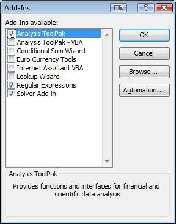
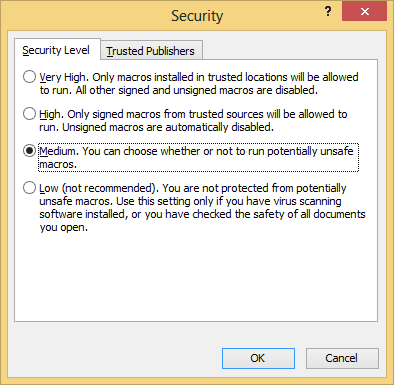

excel-regular-expressions
=========================

VB Extension to add regular expression functions to MS Excel. This extension adds several custom functions to implement the standard VBScript regular expressions.  

https://github.com/malcolmp/excel-regular-expressions
[Download: Regular Expressions.xla](https://github.com/malcolmp/excel-regular-expressions/Regular%20Expressions.xla)

## Installation & Use

**Step 1:** After downloading [Regular Expressions.xla](http://blog.malcolmp.com/Regular Expressions.xla) you can enable it by navigating to Tools >> Add-Ins. You will also need to enable macros by setting your Macro security to at least Medium via Tools >> Macro >> Security . At this level you will be prompted before opening a spreadsheet using regular expressions. If you do not accept, none of the regular expressions will work. Simlilarly, users without a lower than "High" macro security setting will not be able to use the included functions.

**Step 2:** In the dialog that appears click Browse and select Regular Expressions.xla in the directory you downloaded it to.  After enabling the Add-In you can disable it at any time by reopening this dialog and un-checking the box.

**Step 3:** To Insert a function select a cell and click the "Insert Function Button" button to bring up the dialog.  All of the functions and pre-defined regular expression patterns will be listed under the _Regular Expressions_ category.

## Function Descriptions

*   regexREPLACE: Replace all portions of the search text matching the pattern with the replacement text.
*   regexMATCHES: Find and return the number of matches to a pattern in the search text.
*   regexMATCH: Find and return an instance of a match to the pattern in the search text. MatchIndex may be used in the case of multiple matches.
*   regexMATCHALL: Find and return a comma-separated list of all matches to the pattern in the search text.
*   regexGROUP: Find and return a group from within a matched pattern.
*   regexSTARTSWITH: Returns true or false if the search text starts with the pattern.
*   regexENDSWITH: Returns true or false if the search text ends with the pattern.

## Parameter Descriptions

*   pattern (text): the regular expression to use to match. [Regular Expression Syntax](http://msdn.microsoft.com/en-us/library/1400241x%28VS.85%29.aspx "VBScript Regular Expressions")
*   searchText (text): the text to search for a match.
*   replacementText (text): the string to replace the matched portion of the string with.
*   ignoreCase (true/false): Set to false for a case-sensitive match. The default value is true.
*   matchIndex (integer): When multiple matches are found, which one should be returned (1+)
*   group (integer): Which subgroup (section within parenthesis) of the regular expression should be returned.

## Included Patterns

* regexEMAIL():  Email addresses
* regexUSZIP(): 5 & 9 digit US zip codes
* regexPHONE(): Phone numbers
* regexURL(): urls
